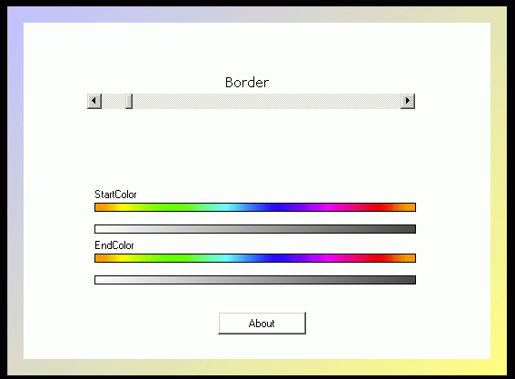



## Gradient Active\-X

### Description

This is an Active-X Control for Filling Form with a Gradient BackGround. It also Contains A ColorChooser control. A Must see For all who Plan to Develop Active-X Controls.
 
### More Info
 

             |
---                |---
**Submitted On**   |2003-08-23 21:45:10
**By**             |[Keral\.C\.Patel\.](https://github.com/Planet-Source-Code/PSCIndex/blob/master/ByAuthor/keral-c-patel.md)
**Level**          |Intermediate
**User Rating**    |4.0 (40 globes from 10 users)
**Compatibility**  |VB 6\.0
**Category**       |[Custom Controls/ Forms/  Menus](https://github.com/Planet-Source-Code/PSCIndex/blob/master/ByCategory/custom-controls-forms-menus__1-4.md)
**World**          |[Visual Basic](https://github.com/Planet-Source-Code/PSCIndex/blob/master/ByWorld/visual-basic.md)
**Archive File**   |[Gradient\_A1643929102003\.zip](https://github.com/Planet-Source-Code/keral-c-patel-gradient-active-x__1-48395/archive/master.zip)

